# ⚡ Flux — Shell Intelligence Platform

> A local-first, high-performance developer workflow intelligence platform built entirely in **Rust**. Flux acts as a programmable intelligence layer for your terminal — capturing shell activity in real-time, reconstructing workflow DAGs, compressing repetitive actions, and providing sub-millisecond context-aware command suggestions.

---

## Table of Contents

- [Overview](#overview)
- [Architecture](#architecture)
- [Installation](#installation)
- [Shell Integration Flow](#shell-integration-flow)
- [Data Pipeline](#data-pipeline)
- [Storage Layer](#storage-layer)
- [Search Engine](#search-engine)
- [Query Language](#query-language)
- [Workflow Mining](#workflow-mining)
- [TUI State Machine](#tui-state-machine)
- [Daemon Architecture](#daemon-architecture)
- [Alias Suggestion Engine](#alias-suggestion-engine)
- [Scoring Algorithm](#scoring-algorithm)
- [CLI Reference](#cli-reference)
- [TUI Keybindings](#tui-keybindings)
- [Configuration](#configuration)
- [Performance Targets](#performance-targets)
- [Development](#development)

---

## Overview

Most shell history tools wrap SQLite and call it done. Flux implements primitives:

| Primitive      | Implementation                                  |
| -------------- | ----------------------------------------------- |
| Storage        | Custom append-only WAL with periodic compaction |
| Indexing       | Radix Trie for O(k) prefix search               |
| Relevance      | BM25 scorer with configurable k1/b parameters   |
| Fuzzy match    | Levenshtein with early termination              |
| Workflow model | Session-clustered command transition DAG        |
| Query          | Hand-written recursive descent parser           |

---

## Architecture

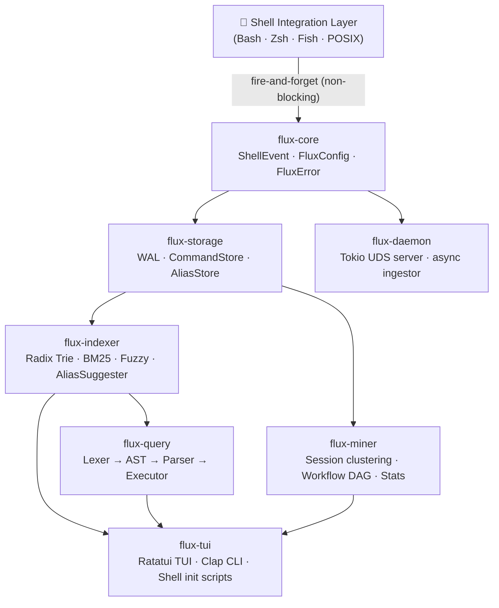

---

## Installation

```bash
git clone https://github.com/you/flux
cd flux
chmod +x install.sh && ./install.sh
```

### Shell Integration

**Bash** — add to `~/.bashrc`:

```bash
eval "$(flux init bash)"
```

**Zsh** — add to `~/.zshrc`:

```bash
eval "$(flux init zsh)"
```

**Fish** — add to `~/.config/fish/config.fish`:

```fish
flux init fish | source
```

---

## Shell Integration Flow

How Flux hooks into your shell without slowing it down:

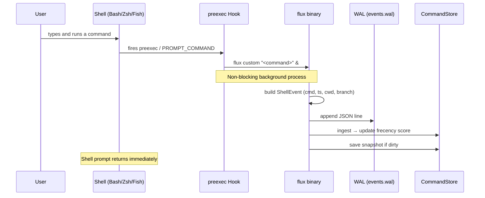

---

## Data Pipeline

End-to-end flow from keypress to ranked suggestion:

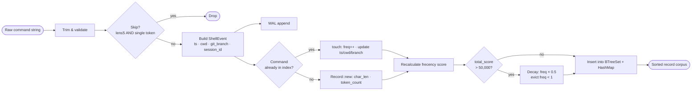

---

## Storage Layer

### WAL Lifecycle

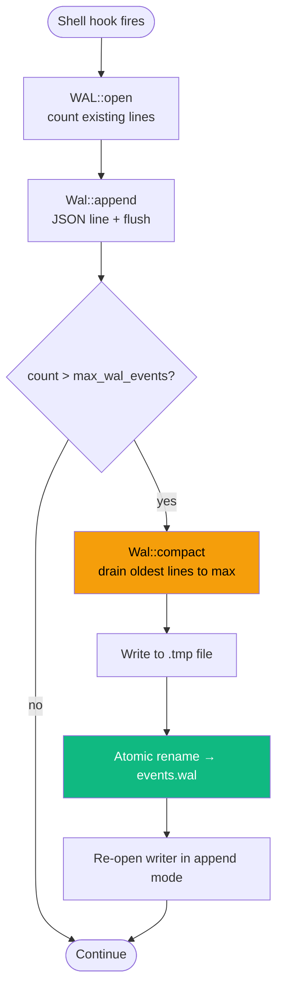

### Store Snapshot & Recovery

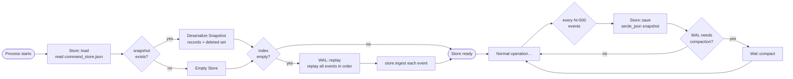

---

## Search Engine

### Multi-Strategy Search Pipeline

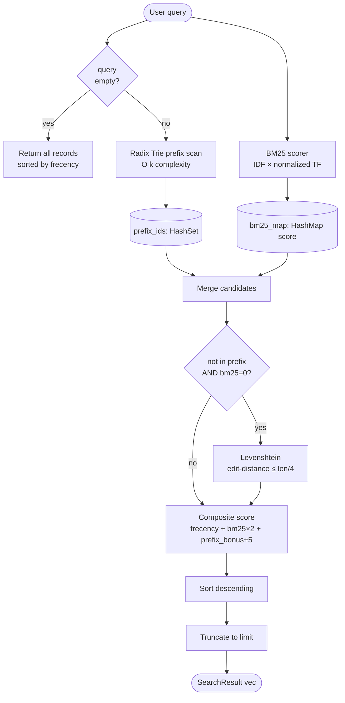

### Radix Trie Node Split

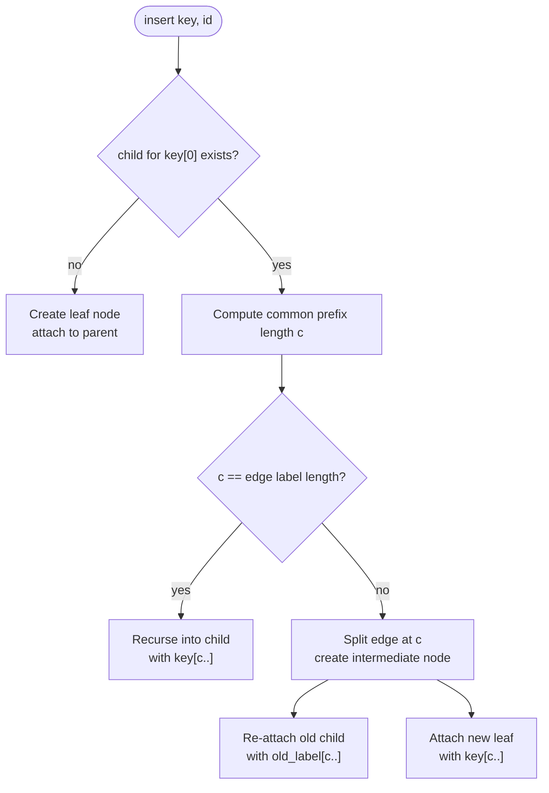

---

## Query Language

### Token → AST → Execution Pipeline

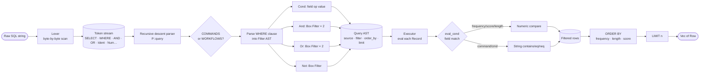

### Supported Query Syntax

```sql
-- Most frequent commands
SELECT * COMMANDS WHERE frequency > 10 ORDER BY frequency LIMIT 20

-- Long commands worth aliasing
SELECT * COMMANDS WHERE length > 30 AND frequency > 3

-- Workflows run many times
SELECT * WORKFLOWS WHERE frequency > 5

-- Commands containing a substring
SELECT * COMMANDS WHERE command = "git" LIMIT 10
```

---

## Workflow Mining

### Session Clustering & N-Gram Subsumption

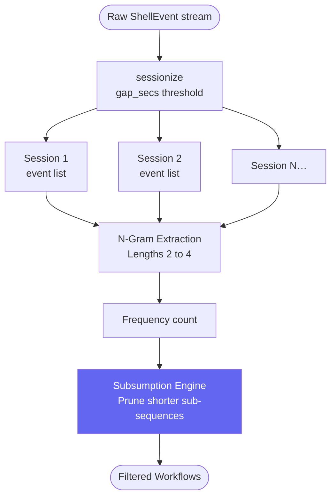

### Markov Chain Transition Model

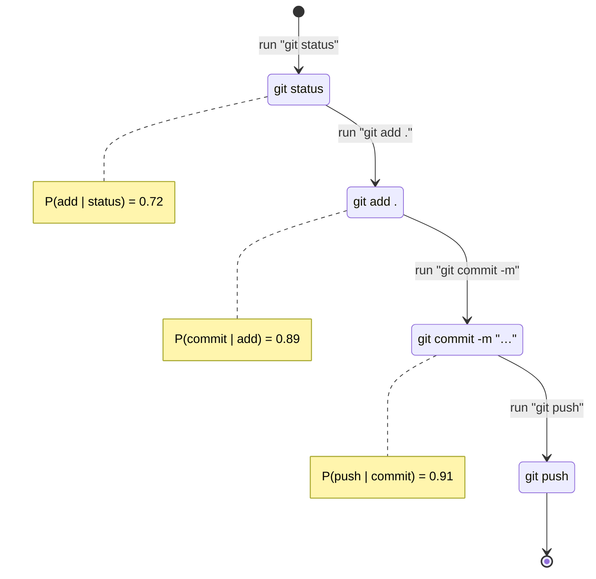

---

## TUI State Machine

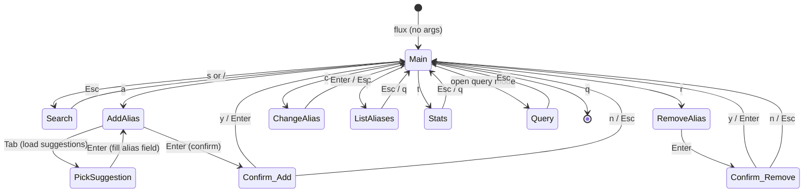

---

## Daemon Architecture

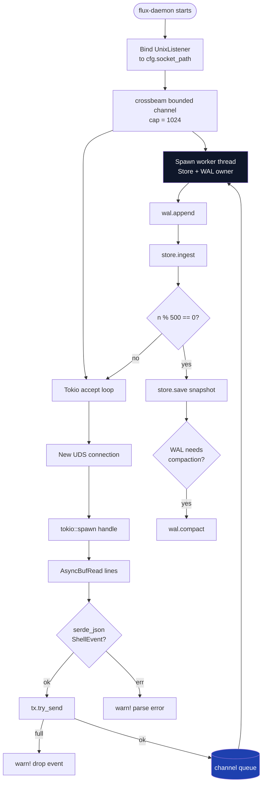

---

## Alias Suggestion Engine

### Suggestion Strategy Pipeline

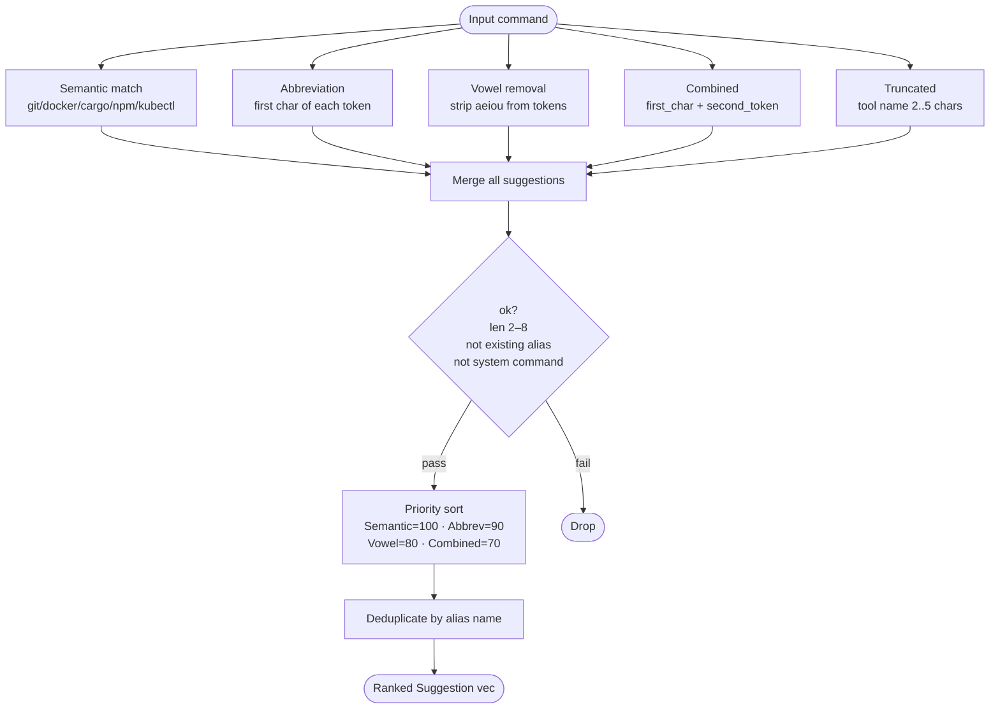

### Semantic Alias Map (Built-in)

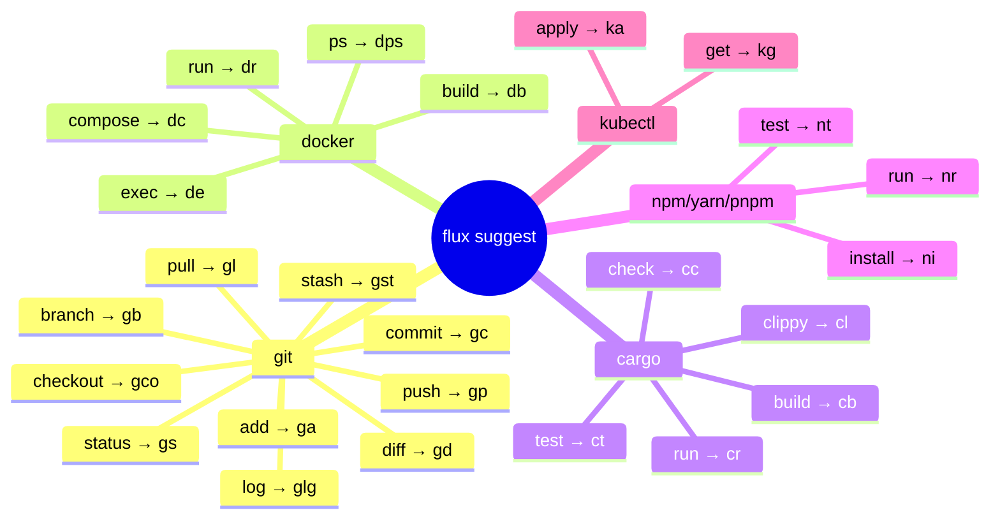

---

## Scoring Algorithm

### Frecency Score Calculation

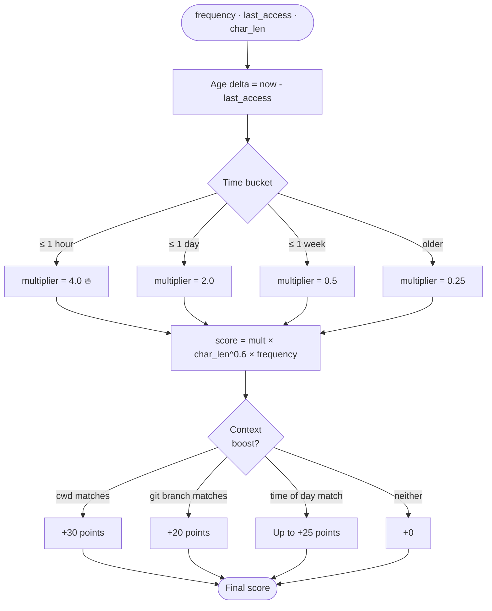

---

## CLI Reference

```
flux                                   Launch interactive TUI
flux suggest -n 10                     Top 10 alias suggestions
flux search "git commit"               Fuzzy search command history
flux search "docker" -l 5              Search with result limit
flux predict "git add ."               Predict the next command sequence
flux context                           Get context-aware commands for your current directory
flux stats                             Workflow analytics & keystroke savings
flux query "SELECT * COMMANDS WHERE frequency > 5 LIMIT 10"
flux add gs -c "git status"            Add an alias
flux remove gs                         Remove an alias
flux change gs gst "git status --short"
flux list                              List all aliases
flux suppress "some long command"      Remove from suggestions
flux init bash | zsh | fish            Print shell init script
```

---

## TUI Keybindings

| Key       | Mode      | Action                         |
| --------- | --------- | ------------------------------ |
| `s` / `/` | Main      | Open fuzzy search              |
| `a`       | Main      | Add alias for selected command |
| `r`       | Main      | Remove alias                   |
| `c`       | Main      | Change alias                   |
| `l`       | Main      | List all aliases               |
| `t`       | Main      | Workflow stats                 |
| `↑` / `k` | Main      | Navigate up                    |
| `↓` / `j` | Main      | Navigate down                  |
| `p`       | Main      | Show workflow predictions      |
| `x`       | Main      | Filter by local context        |
| `Tab`     | Add Alias | Pick from alias suggestions    |
| `F5`      | Main      | Refresh command list           |
| `Esc`     | Any       | Back / cancel                  |
| `q`       | Main      | Quit                           |

---

## Configuration

Config lives at `~/.flux/config.json`. All fields are optional — Flux uses sensible defaults.

```json
{
  "data_dir": "~/.flux",
  "socket_path": "~/.flux/flux.sock",
  "alias_file_paths": ["~/.flux/aliases"],
  "max_wal_events": 50000,
  "bm25_k1": 1.5,
  "bm25_b": 0.75
}
```

| Field              | Default               | Description                                       |
| ------------------ | --------------------- | ------------------------------------------------- |
| `data_dir`         | `~/.flux`             | Where all flux data lives                         |
| `socket_path`      | `~/.flux/flux.sock`   | Unix domain socket for the daemon                 |
| `alias_file_paths` | `["~/.flux/aliases"]` | Alias files to read/write (sourced by shell hook) |
| `max_wal_events`   | `50,000`              | WAL line limit before compaction triggers         |
| `bm25_k1`          | `1.5`                 | BM25 term saturation parameter                    |
| `bm25_b`           | `0.75`                | BM25 length normalization parameter               |

---

## Performance Targets

| Metric                         | Target                        | Implementation                              |
| ------------------------------ | ----------------------------- | ------------------------------------------- |
| Shell hook latency             | **< 2ms**                     | Fire-and-forget background process (`&`)    |
| Search latency (100k commands) | **< 5ms**                     | Radix Trie O(k) prefix + BM25               |
| Daemon idle RAM                | **< 15MB**                    | Bounded crossbeam channel, no heap bloat    |
| WAL compaction                 | triggered at `max_wal_events` | Atomic rename, no data loss                 |
| Score decay                    | automatic                     | Halve frequencies when total_score > 50,000 |

---

## Development

```bash
# Build all crates
cargo build

# Release binary
cargo build --release

# Run the TUI
cargo run

# Run the daemon (optional — CLI works standalone)
cargo run --bin flux-daemon

# Run tests
cargo test
```

### Crate Dependency Graph

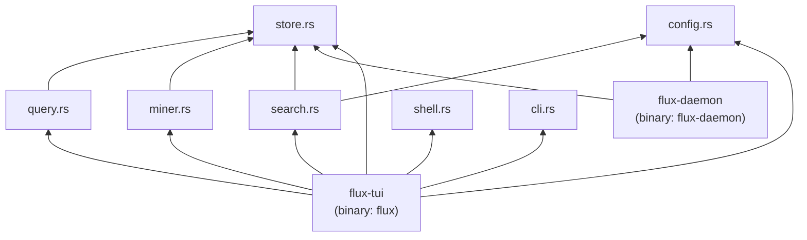

---

## File Layout

```
flux/
├── src/
│   ├── main.rs          # CLI entry point + subcommand dispatch
│   ├── cli.rs           # Clap CLI definitions
│   ├── config.rs        # Config load/save (~/.flux/config.json)
│   ├── store.rs         # CommandStore · WAL · AliasStore · frecency
│   ├── search.rs        # Radix Trie · BM25 · Levenshtein · AliasSuggester
│   ├── miner.rs         # Session clustering · WorkflowDag · MarkovChain · Stats
│   ├── query.rs         # Lexer · AST · recursive descent parser · executor
│   ├── shell.rs         # Shell init script generator (bash/zsh/fish/posix)
│   ├── daemon.rs        # Tokio UDS server (binary: flux-daemon)
│   └── tui/
│       ├── mod.rs       # TUI entry point
│       ├── app.rs       # App state machine
│       ├── events.rs    # Crossterm event handling
│       └── ui.rs        # Rendering logic for all views
├── vendor/
│   └── unicode-segmentation/   # vendored dependency
├── Cargo.toml
├── Cargo.lock
└── install.sh
```

---

<div align="center">

Built with ⚡ in Rust · Local-first · Zero telemetry · Sub-millisecond

</div>
